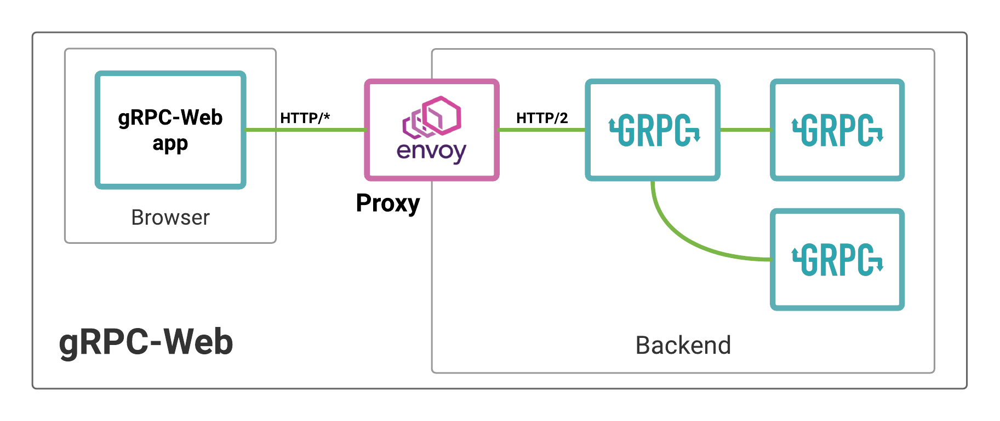

## envoy proxy for grpc-web client



### Prerequisites

- envoy proxy [installtion guide](https://www.envoyproxy.io/docs/envoy/latest/start/install)

### Check prerequisites

```bash
envoy --version
```

### Validating Envoy configuration

```bash
envoy --mode validate -c <filename.yaml>
```

### Run Envoy

- Run `cp .sample.env .env` and fill the env variables in .env

- development

  - local

    ```bash
    ./start-envoy.sh
    ```

  - docker
    - build image
    ```bash
      docker build -f ./dockerfiles/Dockerfile.dev -t dalal-envoy .
    ```
    - run container
    ```bash
      docker run --add-host host.docker.internal:host-gateway -d --name dalal-envoy -p 3000:3000 dalal-envoy
    ```

### TODO

- [ ] production envoy configuration
